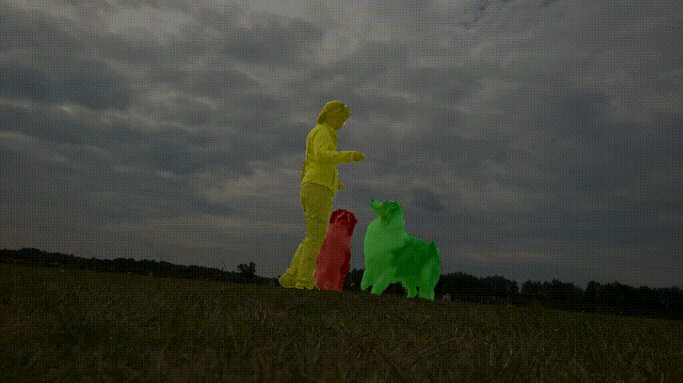

# Training Script for Reuse-VOS

This code implementation of CVPR 2021 paper :  [Learning Dynamic Network Using a Reuse Gate Function in Semi-supervised Video Object Segmentation](https://arxiv.org/abs/2012.11655).

Hard case (Ours, FRTM)

 (Ours)

  (FRTM)

Easy case (Ours, FRTM)

(Ours)

 (FRTM)

## Requirement
### python package
- torch
- python-opencv
- skimage
- easydict

### GPU support

- GPU Memory >= 11GB (RN18)
- CUDA >= 10.0
- pytorch >= 1.4.0


## Datasets

### DAVIS

To test the DAVIS validation split, download and unzip the 2017 480p trainval images and annotations [here](https://data.vision.ee.ethz.ch/csergi/share/davis/DAVIS-2017-trainval-480p.zip).

```
/path/DAVIS
|-- Annotations/
|-- ImageSets/
|-- JPEGImages/
```

### YouTubeVOS

To test our validation split and the YouTubeVOS challenge 'valid' split, download [YouTubeVOS 2018](https://youtube-vos.org/dataset/)
and place it in this directory structure:

```
/path/ytvos2018
|-- train/
|-- train_all_frames/
|-- valid/
`-- valid_all_frames/
```

## Release

### DAVIS 

| model         |Backbone  |Training set         | J & F 17 | J & F 16| link  |
|---------------|:--------:|:-------------------:|:--------:|:-------:|:-----:|
| G-FRTM (t=1)  | Resnet18 | Youtube-VOS + DAVIS | 71.7 | 80.9 | [Google Drive](https://drive.google.com/file/d/1xRzAQQ9fbNDpr0NA55Ain0IZD-_tnl3Q/view?usp=sharing)| 
| G-FRTM (t=0.7)| Resnet18 | Youtube-VOS + DAVIS | 69.9 | 80.5 | same pth|
| G-FRTM (t=1)  | Resnet101| Youtube-VOS + DAVIS | 76.4 | 84.3 | [Google Drive](https://drive.google.com/file/d/1NBmmntbts_weg9GIxjGl8pFMjGjw89Yv/view?usp=sharing)| 
| G-FRTM (t=0.7)| Resnet101| Youtube-VOS + DAVIS | 74.3 | 82.3 | same pth| 

### Youtube-VOS

| model         |Backbone  |Training set | G    | J-S  | J-Us | F-S  |F-Us  | link |
|---------------|:--------:|:-----------:|:----:|:----:|:----:|:----:|:----:|:----:|
| G-FRTM (t=1)  | Resnet18 | Youtube-VOS | 63.8 | 68.3 | 55.2 | 70.6 | 61.0 | [Google Drive](https://drive.google.com/file/d/1FQLgkIX6Iaj5vKGN20ZfAdk_mE0xwgzR/view?usp=sharing)|
| G-FRTM (t=0.8)| Resnet18 | Youtube-VOS | 63.4 | 67.6 | 55.8 | 69.3 | 60.9 | same pth|
| G-FRTM (t=0.7)| Resnet18 | Youtube-VOS | 62.7 | 67.1 | 55.2 | 68.2 | 60.1 | same pth|

We initialize orignal-FRTM layers from official FRTM repository weight for Youtube-VOS benchmark.
S = Seen, Us = Unseen

### Target model cache
Here is the cache file we used for ResNet18 [file](https://drive.google.com/file/d/177Dm65wAIqoZINRtl-HIyGPJUNG7DUQi/view?usp=sharing)


## Run
### Train

Open `train.py` and adjust the `paths` dict to your dataset locations, checkpoint and tensorboard
output directories and the place to cache target model weights.

To train a network, run following command.

```shell script
python train.py --name <session-name> --ftext resnet18 --dset all --dev cuda:0
```
`--name` is the name of save_dir name of current train
`--ftext` is the name of the feature extractor, either resnet18 or resnet101.
`--dset` is one of dv2017, ytvos2018 or all ("all" really means "both").
`--dev` is the name of the device to train on.
`--m1` is the margin1 for training reuse gate, and we use 1.0 for DAVIS benchmark and 0.5 for Youtube-VOS benchmark.
`--m2` is the margin2 for training reuse gate, and  we use 0. 

Replace "session-name" with whatever you like. Subdirectories with this name
will be created under your checkpoint and tensorboard paths.


### Eval

Open `eval.py` and adjust the `paths` dict to your dataset locations, checkpoint and tensorboard
output directories and the place to cache target model weights.

To train a network, run following command.

```shell script
python evaluate.py --ftext resnet18 --dset dv2017val --dev cuda:0
```
`--ftext` is the name of the feature extractor, either resnet18 or resnet101.
`--dset` is one of dv2016val, dv2017val, yt2018jjval, yt2018val or yt2018valAll
`--dev` is the name of the device to eval on.
`--TH` Threshold for tau default= 0.7

The inference results will be saved at `${ROOT}/${result}` .
It is better to check multiple pth file for good accuracy.

## Acknowledgement
This codebase borrows the code and structure from [official FRTM repository](https://github.com/andr345/frtm-vos).
We are grateful to Facebook Inc. with valuable discussions.
## Reference
The codebase is built based on following works
```Bibtex
@misc{park2020learning,
      title={Learning Dynamic Network Using a Reuse Gate Function in Semi-supervised Video Object Segmentation}, 
      author={Hyojin Park and Jayeon Yoo and Seohyeong Jeong and Ganesh Venkatesh and Nojun Kwak},
      year={2020},
      eprint={2012.11655},
      archivePrefix={arXiv},
      primaryClass={cs.CV}
}

```

